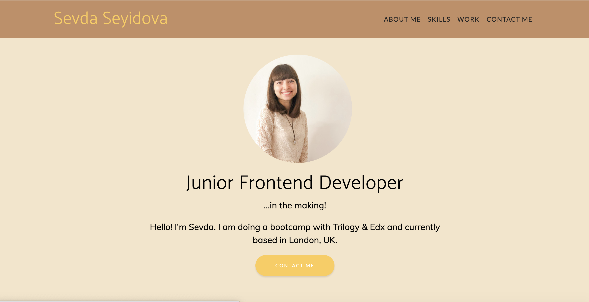
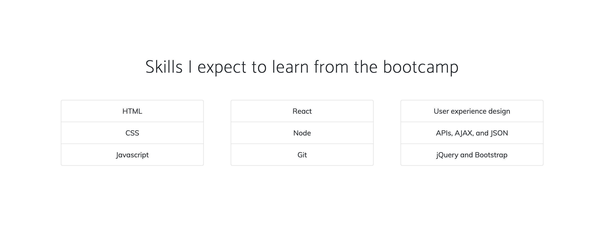
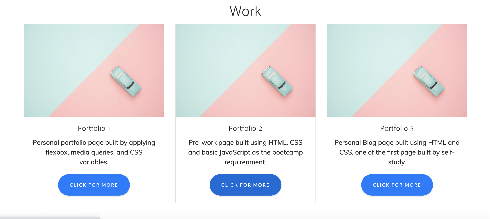
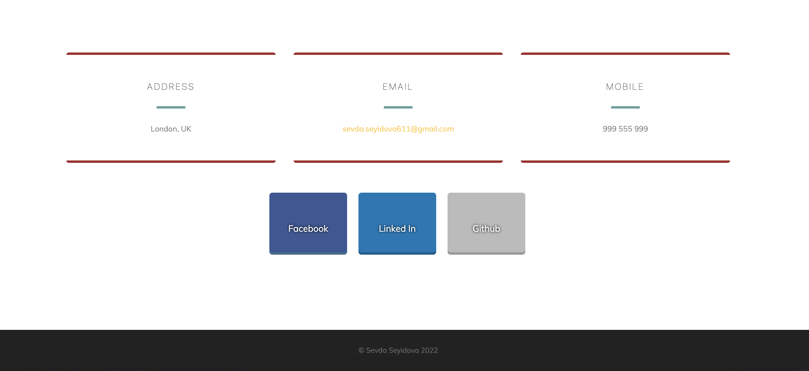

# Bootstrap-Portfolio
My portfolio web page layout was built using the Bootstrap CSS Framework from scratch.

## Links

https://helloseva.github.io/Bootstrap-Portfolio/

## Description 

This personal portfolio page was built using the Bootstrap CSS Framework as a requirenment of the bootcamp, Module 3. The website has a header with links to sections about me, my work, skills and how to contact me. When the page is loaded the page presents my name, my recent photo and contact me button. When the page is resized or viewed on various screens and devices then the layout is responsive and adapts to my viewport.

## Table of Contents (Optional)

* [Installation]
* [Usage]
* [License]

## Installation

1. Go To https://github.com/helloseva/Bootstrap-Portfolio
2. Copy the Git clone link using SSH.
3. In terminal on your local device, clone the repository using Git clone.
4. Open in Visual Studio.

## Usage 

This page is about me and my works. It can be used to to have a look on my recent Resume and contact details on how to reach me.

Screeshot of the Web Page:

## Credits

N/A

## License

Please refer to the LICENSE in the repo.
